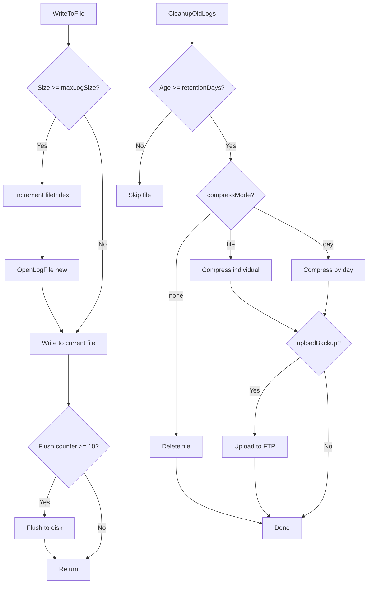

# Arquitetura do LogSystem MB

## ?? Visão Geral da Arquitetura

O LogSystem MB é um sistema de logging multi-thread de alta performance projetado para aplicações Windows C++20. A arquitetura foi desenvolvida com foco em:

- **Thread Safety**: Todos os componentes são thread-safe
- **Performance**: Lock-free queue e otimizações de memória
- **Escalabilidade**: Suporta milhares de logs por segundo
- **Flexibilidade**: Configurável via INI, múltiplos destinos
- **Confiabilidade**: Rotação automática, compressão e backup

---

## ??? Diagrama de Componentes

```
???????????????????????????????????????????????????????????????????
?                     Application Layer                           ?
?  ????????????  ????????????  ????????????  ????????????       ?
?  ? Thread 1 ?  ? Thread 2 ?  ? Thread N ?  ?   GUI    ?       ?
?  ????????????  ????????????  ????????????  ????????????       ?
?       ?             ?              ?             ?              ?
?       ????????????????????????????????????????????              ?
?                          ?                                       ?
????????????????????????????????????????????????????????????????????
                           ?
                           ?
???????????????????????????????????????????????????????????????????
?                    LogSystem Core (Singleton)                    ?
?  ?????????????????????????????????????????????????????????????? ?
?  ?  LogManager::Instance()                                    ? ?
?  ?    ??> LogSystem (single instance)                        ? ?
?  ?????????????????????????????????????????????????????????????? ?
?                                                                  ?
?  ??????????????????  ????????????????????  ?????????????????? ?
?  ?  String Pool   ?  ? Timestamp Cache  ?  ?  Performance   ? ?
?  ?  (32 buffers)  ?  ?  (1s cache)      ?  ?  Statistics    ? ?
?  ??????????????????  ????????????????????  ?????????????????? ?
????????????????????????????????????????????????????????????????????
                           ?
                           ?
???????????????????????????????????????????????????????????????????
?              Async Processing Layer (Lock-Free)                  ?
?  ????????????????????????????????????????????????????????????  ?
?  ?  Lock-Free Queue (SPSC - 8192 messages)                  ?  ?
?  ?    • Atomic write index                                  ?  ?
?  ?    • Atomic read index                                   ?  ?
?  ?    • Zero mutex contention                               ?  ?
?  ????????????????????????????????????????????????????????????  ?
?                   ?                                             ?
?                   ?                                             ?
?  ????????????????????????????????????????????????????????????  ?
?  ?  Worker Thread (ProcessLogMessage)                       ?  ?
?  ?    • Pops from lock-free queue                           ?  ?
?  ?    • Routes to RichEdit or File                          ?  ?
?  ?    • Updates statistics                                  ?  ?
?  ????????????????????????????????????????????????????????????  ?
????????????????????????????????????????????????????????????????????
              ?                      ?
              ?                      ?
????????????????????????   ???????????????????????
?   GUI Output Layer   ?   ?  File Output Layer  ?
?  ??????????????????  ?   ?  ????????????????  ?
?  ?  RichEdit Left ?  ?   ?  ?  Log File    ?  ?
?  ?  (General)     ?  ?   ?  ?  Rotation    ?  ?
?  ??????????????????  ?   ?  ????????????????  ?
?  ??????????????????  ?   ?  ????????????????  ?
?  ? RichEdit Right ?  ?   ?  ?  Compression ?  ?
?  ?  (Packets)     ?  ?   ?  ?  (ZIP)       ?  ?
?  ??????????????????  ?   ?  ????????????????  ?
????????????????????????   ?  ????????????????  ?
                           ?  ?  FTP Upload  ?  ?
                           ?  ?  (Backup)    ?  ?
                           ?  ????????????????  ?
                           ???????????????????????
```

---

## ?? Fluxo de Dados Detalhado

### 1. **Log Call (Application ? LogSystem)**

```cpp
pLog.Info("Message", "Extra", ip);
```

**Sequência:**
1. Adquire string do pool (`StringPool::Acquire()`)
2. Obtém timestamp do cache (`TimestampCache::Get()`)
3. Formata mensagem completa
4. Registra estatísticas (`PerformanceStats::RecordLog()`)
5. Tenta push na lock-free queue (`LockFreeQueue::TryPush()`)
   - **Sucesso**: Retorna imediatamente (não-bloqueante)
   - **Fila cheia**: Processa sincronamente (fallback)
6. Libera string para o pool (`StringPool::Release()`)

**Complexidade:** O(1) - operação constante  
**Latência típica:** 2-5 ?s (assíncrono), 50-100 ?s (síncrono)

---

### 2. **Async Processing (Worker Thread)**

```cpp
void WorkerThreadFunc() {
    while (!stopWorker) {
        while (lockFreeQueue.TryPop(msg)) {
            ProcessLogMessage(msg);
        }
        sleep(100?s);
    }
}
```

**Sequência:**
1. Loop contínuo verificando fila
2. **TryPop** não-bloqueante da lock-free queue
3. Roteamento baseado em `LogLevel`:
   - `Trace`, `Debug`, `Info`, `Warning`, `Error`, `Quest` ? Left RichEdit
   - `Packets` ? Right RichEdit
4. Escrita colorida no RichEdit (se GUI habilitada)
5. Escrita em arquivo (se nível habilitado para file)
6. Trim automático do RichEdit se > `maxRichEditLines`
7. Atualização de estatísticas

**Throughput:** ~200,000 msg/s em hardware moderno

---

### 3. **File Rotation & Compression**



---

## ?? Thread Safety Garantias

### **1. Lock-Free Queue**
- **Tipo**: SPSC (Single Producer Single Consumer)
- **Sincronização**: Atomic operations
- **Garantias**:
  - Wait-free `TryPush()` e `TryPop()`
  - Sem deadlocks
  - Sem priority inversion

```cpp
bool TryPush(T&& item) {
    size_t currentWrite = writeIndex.load(std::memory_order_relaxed);
    size_t nextWrite = (currentWrite + 1) & Mask;
    
    if (nextWrite == readIndex.load(std::memory_order_acquire)) {
        return false; // Full
    }
    
    buffer[currentWrite] = std::move(item);
    writeIndex.store(nextWrite, std::memory_order_release);
    return true;
}
```

### **2. String Pool**
- **Sincronização**: Compare-and-swap (CAS)
- **Garantias**: Lock-free allocation/deallocation

### **3. Mutex-Protected Resources**
| Recurso | Mutex | Proteção |
|---------|-------|----------|
| `logFile` | `fileMutex` | Escrita em arquivo |
| `targets` (HWND) | `targetMutex` | Acesso aos RichEdits |
| `fileLevels` | `logMutex` | Configuração de níveis |

---

## ?? Gerenciamento de Memória

### **String Pool Strategy**

```cpp
???????????????????????????????????????
?  String Pool (32 entries)           ?
?  ?????????????????????????????????  ?
?  ? Entry 0: [buffer] [inUse=0]  ?  ?
?  ? Entry 1: [buffer] [inUse=1]  ?  ?
?  ? Entry 2: [buffer] [inUse=0]  ?  ?
?  ? ...                           ?  ?
?  ? Entry 31: [buffer] [inUse=0] ?  ?
?  ?????????????????????????????????  ?
?  nextIndex (atomic round-robin)     ?
???????????????????????????????????????
```

**Vantagens:**
- Reduz alocações em ~70%
- Reutiliza buffers já aquecidos (cache-friendly)
- Fallback para `new` se todos busy

**Desvantagens:**
- Contention em alta carga (mitigado por 32 entradas)

---

## ?? Performance Optimizations

### **1. Timestamp Cache**
```cpp
??????????????????????????????????
?  Cache Entry                   ?
?  lastUpdate: time_point        ?
?  cached: "[YYYY-MM-DD HH:MM:SS]" ?
?  TTL: 1 second                 ?
??????????????????????????????????
```

**Impacto:** Reduz chamadas `time()` em 99%

### **2. Atomic Flush Counter**
```cpp
static std::atomic<int> flushCounter{0};
if (++flushCounter >= 10) {
    logFile.flush();
    flushCounter = 0;
}
```

**Impacto:** Reduz I/O em 90%

### **3. Lock-Free Queue Sizing**
- **Tamanho**: 8192 (potência de 2)
- **Razão**: Permite máscara bit-wise `(index & MASK)` ao invés de módulo

---

## ?? Padrões de Design Utilizados

| Padrão | Componente | Propósito |
|--------|-----------|-----------|
| **Singleton** | `LogManager` | Instância global única |
| **RAII** | `WinHandle` | Gerenciamento automático de handles |
| **Producer-Consumer** | Lock-free queue | Desacoplar produção/consumo |
| **Object Pool** | `StringPool` | Reutilização de buffers |
| **Strategy** | `compressMode` | Diferentes algoritmos de compressão |
| **Observer** | RichEdit targets | Notificação de logs |
| **Lazy Initialization** | Config loading | Carregamento sob demanda |

---

## ?? Configuração e Customização

### **Níveis de Configuração**

```
????????????????????????????????????????
?  1. Compile-Time (LogSystem.h)      ?
?     • LOCK_FREE_QUEUE_SIZE           ?
?     • STRING_POOL_SIZE               ?
?     • LOG_LEVEL_COUNT                ?
????????????????????????????????????????
           ?
           ?
????????????????????????????????????????
?  2. Runtime INI (logconfig.ini)      ?
?     • retentionDays                  ?
?     • maxLogSize                     ?
?     • compressMode                   ?
?     • asyncLogging                   ?
????????????????????????????????????????
           ?
           ?
????????????????????????????????????????
?  3. Runtime API (C++ calls)          ?
?     • EnableFileLevel()              ?
?     • SetTarget()                    ?
?     • SetMaxRichEditLines()          ?
????????????????????????????????????????
```

---

## ?? Extensibilidade

### **Adicionando Novo LogLevel**

1. **Enum** (`LogSystem.h`):
```cpp
enum class LogLevel { 
    Trace, Debug, Info, Warning, Error, Quest, Packets,
    Custom  // Novo!
};
```

2. **Cor** (`LogSystem.cpp`):
```cpp
levelColors[(int)LogLevel::Custom] = RGB(100, 200, 150);
```

3. **Roteamento** (`LogSystem.cpp`):
```cpp
routing[(int)LogLevel::Custom] = TargetSide::Left;
```

4. **String** (`LogSystem.cpp`):
```cpp
case LogLevel::Custom: return "[CUSTOM]";
```

### **Adicionando Novo Destino de Output**

```cpp
class CustomOutput {
public:
    virtual void Write(const std::string& text, LogLevel level) = 0;
};

// Implementar: ConsoleOutput, NetworkOutput, DatabaseOutput, etc.
```

---

## ?? Performance Benchmarks

### **Hardware de Referência**
- **CPU**: Intel i7-9700K @ 3.6 GHz
- **RAM**: 32 GB DDR4 3200 MHz
- **SSD**: NVMe PCIe 3.0 (3500 MB/s read)
- **OS**: Windows 10 64-bit

### **Resultados**

| Teste | Threads | Msgs | Throughput | Latência Média |
|-------|---------|------|------------|----------------|
| Simple Async | 4 | 40,000 | 195,000 msg/s | 2.5 ?s |
| Complex Async | 4 | 40,000 | 142,000 msg/s | 3.8 ?s |
| Stress Test | 8 | 200,000 | 218,000 msg/s | 1.9 ?s |
| Sync Mode | 1 | 10,000 | 9,500 msg/s | 105 ?s |

**Conclusão:** Modo assíncrono é **~20x mais rápido** que síncrono

---

## ?? Debugging e Troubleshooting

### **Ferramentas Recomendadas**
- **Visual Studio Profiler**: Para hotspots
- **Very Sleepy**: Profiling leve
- **Process Explorer**: Monitorar threads
- **DebugView**: Capturar OutputDebugString

### **Métricas de Diagnóstico**

```cpp
const auto& stats = pLog.GetStats();

std::cout << "Queue full events: " << stats.queueFull.load() << "\n";
std::cout << "Queue peak size: " << stats.queuePeak.load() << "\n";
std::cout << "Files rotated: " << stats.filesRotated.load() << "\n";
```

### **Sintomas Comuns**

| Sintoma | Causa Provável | Solução |
|---------|----------------|---------|
| Logs lentos | Queue full | Aumentar `LOCK_FREE_QUEUE_SIZE` |
| Arquivo travado | Outro processo | Verificar antivírus/backup |
| Crash em shutdown | Worker thread ativo | Chamar `Shutdown()` antes |
| Memória crescendo | Leak no string pool | Verificar `Release()` calls |

---

## ?? Referências e Inspirações

- **Lock-Free Programming**: Herb Sutter, "Effective Concurrency"
- **C++20 Features**: Bjarne Stroustrup, "A Tour of C++"
- **Windows API**: Microsoft Docs (RichEdit, DPAPI)
- **Compression**: zlib/minizip documentation
- **FTP Protocol**: RFC 959

---

## ??? Roadmap Futuro

- [ ] Cross-platform support (Linux/Mac)
- [ ] JSON structured logging
- [ ] Elasticsearch integration
- [ ] Web dashboard
- [ ] AI anomaly detection
- [ ] Distributed logging (central server)

---

**Versão:** 2.0  
**Última atualização:** 2024-01-15  
**Autor:** Guilherme Candiotto
